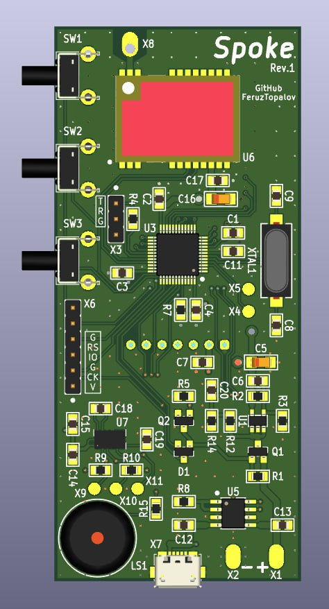

# **SPOKE** - _Stay close!_

  

  <i>*Like a spoke in a wheel</i>

Spoke is a GPS-based Local Relative Navigation System (LRNS) for group of up to 5 members. It allows you to share your positional data in **real-time** among other Spoke-devices and navigate to each of them in a relative manner by providing **Distance** and **Azimuth** information - like radar does. There are some helpful features like geo-fence, timeout and user alarm.  Also you can navigate to saved points!

## Demonstration

Join our chat to see more: <[https://t.me/lrns_eleph](https://t.me/lrns_eleph)>

  

## Problem & Solution

As long as you stay under cell-coverage a navigation, either absolute or relative, is not a problem at all. You just use your phone with maps and messengers to find or share locations. Things change when you go off-grid. Hiking, skiing, sailing or whatever outdoor activity are a potential place to lose sight of your teammates. How to navigate in the group? Hopefully, there are couple of solutions available on the market:

* [LynQ](https://lynqme.com/pages/dev-consumer)
* [XQUAD](https://www.indiegogo.com/projects/xquad-smart-location-tracking-without-phones#/)
* [GoFindMe](https://www.indiegogo.com/projects/gofindme-a-gps-tracker-works-without-cell-service/#/)
* [GoTenna](https://gotennamesh.com/products/mesh)
* Also [GARMIN Dog collar](https://buy.garmin.com/en-US/US/c12522-p1.html)
* Also any [AIS](https://en.wikipedia.org/wiki/Automatic_identification_system) system

unfortunately all of them are commercial. But not the **Spoke**! 

**Spoke** is _open-source/open-hardware_ device which contains all major features needed for group navigation, such as:

* Detailed absolute positional information about each device in group
* Radar-like interface with relative positional information about each device in group
* eCompass for quick orientation
* Memory points to save the position of any device and navigate it later
* GeoFence feature
* Timeout feature
* Alarm button

Due to open-source and simple and cheap hardware, Spoke is highly flexible solution that could be adapted to any use case you want:

* Hiking
* Climbing
* Sailing
* Hunting with the dogs
* Assets tracking
* and more...

## Technology

Spoke is written in pure C and runs on STM32 microcontroller. It has GPS module to receive positional data and synchronization signal, radio transceiver to exchange with radio packets between other devices, graphical display to show information on it, tactile buttons to control the device, buzzer to notify about events and couple of LEDs.

GPS module provides NMEA-0183 stream at 9600 baud. Microcontroller process the stream using DMA and parse it. Fields being extracted are RMC, GGA, GSA, GSV. Those give us information about time, date, latitude, longitude, speed, course, altitude, satellites in view and in use, navigation mode and validness of data.

GPS module also provides time synchronization signal - PPS. It is used as a time reference for the transmitting and receiving radio packets inside a current group of devices. Each group operates at the specific frequency channel, the way like regular radios. Each device in a group has unique predefined number from 1 to 5, so there are 5 members in a group maximum. Spoke uses TDMA technique to give channel access for each group member, so the device number corresponds to the time-slot occupied by device. There is a 50 ms timer which starts counting from the rising edge of the PPS pulse. First 100 ms time-slot is used to parse and prepare positional data of the device. Next 5 time-slots are used to exchange with the positional data between devices via radio. A device is in TX state when time-slot number is equal to the device number, and in RX state otherwise. Remaining time before next PPS is reserved for relative positions calculation and displaying the results.

|  NMEA  | Time slot 1 | Time slot 2 | Time slot 3 | Time slot 4 | Time slot 5 | Processing |
|--------|-------------|-------------|-------------|-------------|-------------|------------|
| 100 ms | 150 ms      | 150 ms      | 150 ms      | 150 ms      | 150 ms      | 150 ms     |

Spoke uses GFSK transceiver and operates in LPD 433 MHz band (please make sure you are allowed to use those frequencies in your region, change otherwise). Data rate is 1200 bps, deviation is 1200 Hz (mod index = 2), channel spacing is 25 kHz. Packet structure is shown below. It consist of 19 bytes total and takes ~126 ms to be transmitted over-the-air.

| 3 bytes  |  2 bytes  |    12 bytes     | 2 bytes |
|----------|-----------|-----------------|---------|
| Preamble | Sync Word | Payload (below) | CRC     |

|       1 byte       | 1 byte | 4 bytes  |  4 bytes  | 2 bytes  |
|--------------------|--------|----------|-----------|----------|
| Device ID & Number | Flags  | Latitude | Longitude | Altitude |

In order to calculate relative positions of other devices, Spoke uses two formulas. First one is [Haversine formula](https://en.wikipedia.org/wiki/Haversine_formula) which determines the distance between two points on a sphere. The second one is [Loxodrome formula](https://en.wikipedia.org/wiki/Rhumb_line) which determines bearing to a point on a sphere relative to true north. All calculations are performed with a highest possible, double precision, so the results are in a great agreement with my simulations on PC. Precision of the formulas is another matter. It is known that haversine formula is numerically better-conditioned for small distances, but on the other side it doesn't take into account ellipsoidness of the Earth and uses it's mean radius. Also it is known that loxodrome (or rhumb line) shows not-the-shortest way to reach point of interest (the shortest way is provided by orthodrome, or great circle route), but the constant bearing, which is more useful in practice. Anyway, my simulations using Google Earth Pro ruler leave me no concerns about accuracy of used formulas. According to them the error for both is less than 1% as long as the distance is smaller than 300 km (!).

  <i>(courtesy of <a href="https://www.esri.com/arcgis-blog/products/product/mapping/mercators-500th-birthday/">ESRI</a>)</i>

---
