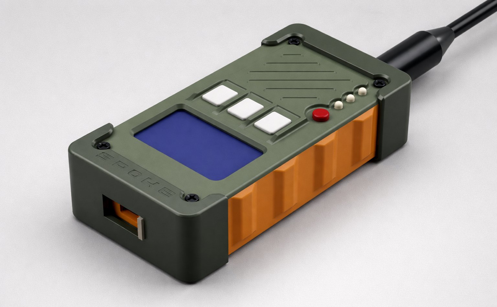
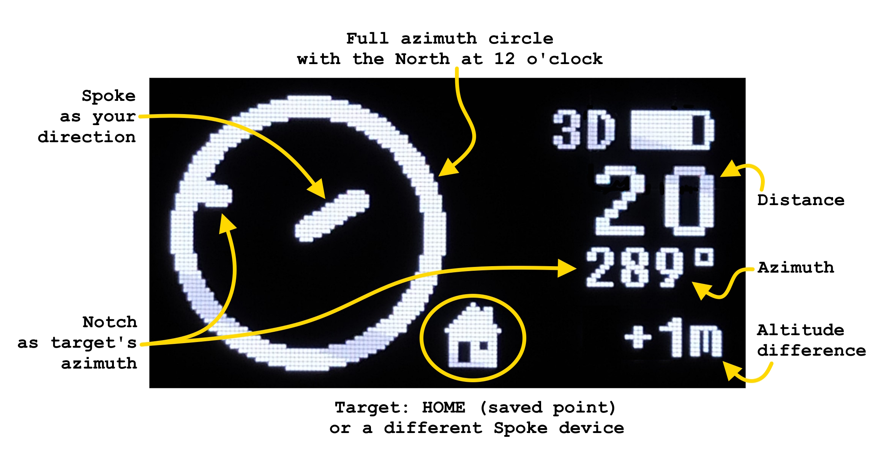
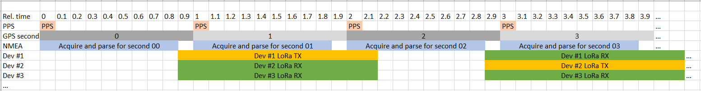

# **SPOKE*** - _Stay close!_ 
_*Like a spoke in a wheel_

<p align="center">
  
</p>

<p align="center">
🔓 Open-source<br>
🛠️ Open-hardware<br>
🛰️ GPS-based<br>
📡 LoRa-enabled<br>
🔋 Off-grid<br>
✨ Feature-rich<br>
🧭 Local Relative Navigation System<br>
<br>
or<br>
<br>
📍 just a LoRa GPS tracker for group 😉<br>
</p>

<p align="center">
  
</p>

---

## 📋 Table of Contents

- [About](#about)
- [Use Cases](#use-cases)
- [Key Features](#key-features)
- [Hardware](#hardware)
- [Technology & How It Works](#technology--how-it-works)
- [Navigation Algorithms](#navigation-algorithms)
- [Getting Started](#getting-started)
- [Configuration](#configuration)
- [Frequency Bands](#frequency-bands)
- [Community](#community)
- [Contributing](#contributing)
- [Support the Project](#support-the-project)

---

## About

**Spoke** is a GPS tracker for a group of up to 5 members. It enables **real-time positional data sharing** in a group, providing **Distance** and **Azimuth** information in a **radar-like interface** where a 360-degree azimuth circle shows your direction as a **spoke** and azimuth to target as a **notch**. 

<p align="center">
  
</p>

Besides navigation function, Spoke has **extra safety features** like: 
- **Alarm distress signal** - with a dedicated red button to easily call group members for help
- **Timeout alert** - with configurable timeout in seconds
- **Radial geo-fence alert** - with configurable distance in meters

---

## Use Cases

Spoke's open-source nature and flexible hardware make it adaptable to numerous scenarios:

- 🥾 **Hiking & Trekking** - Keep your group together on trails
- 🧗 **Climbing & Mountaineering** - Track team members on challenging terrain
- ⛵ **Sailing & Boating** - Monitor vessel positions without AIS
- 🎿 **Skiing & Snowboarding** - Stay connected in backcountry areas
- 🏕️ **Camping & Outdoor Adventures** - Know where everyone is at camp
- 🐕 **Hunting with Dogs** - Track your hunting dogs' positions
- 📦 **Asset Tracking** - Monitor equipment or vehicles in remote locations
- 🚴 **Off-road Biking** - Keep your riding group coordinated
- 🔍 **Search & Rescue** - Coordinate team members during operations


---

## Key Features

### Navigation & Tracking
- **Real-time group tracking** for up to 5 devices with radar-like display
- **Absolute positioning** with GPS coordinates (latitude, longitude, altitude)
- **Relative positioning** with distance and azimuth to each group member
- **Memory points** to save locations and navigate to them later
- **Interactive eCompass** for quick orientation with ad-hoc calibration support
- **Magnetic and True North** display modes

### Communication
- **LoRa long-range radio** communication (up to several kilometers)
- **TDMA synchronization** using GPS PPS signal for collision-free transmission
- **Multi-band support:** 433 MHz or 868 MHz with 1% duty cycle compliance
- **License-free frequency channels** depending on the frequency band and country of operation
- **Configurable update intervals:** 10, 30, 60, or 120 seconds

### Safety Features
- **GeoFence alert** - notification when a member leaves defined circle around you
- **Timeout alert** - notification when connection to a member is lost for a defined time
- **Dedicated alarm button** for emergency signaling
- **Battery-low monitoring** and notification to other members

---

## Hardware

### PCB

Spoke is assembled on a simple, 2-layer, 1.6 mm thick PCB of 100 x 50 mm size. It uses well-known and popular electronic components that are easy to get. Some of them may be or already are obsolete, but are still available on the market, or even in your own stock! Spoke is not critical to values and nominals of components, so it can be easily adapted to your parts source. Some components are optional to install, which adds extra flexibility if you do not need particular functionality.

<p align="center">
  
</p>

### Core Components

| Component | Specification | Purpose | Install option |
|-----------|---------------|---------|---------|
| **MCU** | STM32F103C8T6 (BluePill) | Main processing unit | Mandatory |
| **GPS Module** | QUESCAN models G10A-F30 or TU10-F <br> or any other with wires | Position and time synchronization | Mandatory |
| **Radio Module** | Semtech SX126x-based <br> E22-400M22S or E22-900M22S | LoRa communication | Mandatory |
| **Display** | 1.3" Monochrome LCD (ST7567 controller) | User interface | Mandatory |
| **eCompass** | LSM303DLHC | Orientation and motion sensing | Optional |
| **USB Interface** | Type-C with CP2102N-28 USB-UART converter | Programming and Nav data stream | Optional |
| **BLE Module** | E104-BT5005A BLE-UART bridge | Wireless Nav data stream | Optional |
| **Multiplexer** | 74HC4052PW | Switching Nav data stream between USB and BLE | Optional |
| **Power Regulator** | LM3671MF-3.3 DC/DC | Efficient power management |Mandatory |
| **Battery** | Li-ion/Li-Po 2200 mAh <br> 70 x 40 x 6 mm max  | Power source | Mandatory |
| **Charging IC** | TP4056 | Battery charging management | Mandatory |

---

## Technology & How It Works

### Software Architecture

Spoke firmware is written in **pure C** using CMSIS and runs on the STM32F103C8T6 ARM Cortex-M3 microcontroller. The firmware features:

- **Modular design** with compile-time configuration
- **Watchdog protection** for system stability
- **Peripheral clock gating** for power optimization
- **DMA-based data processing** for efficiency
- **Double-precision calculations** for navigation accuracy

### GPS Processing

- **Configurable baud rates** (9600, 38400, 57600 and 115200 baud)
- **NMEA-0183 stream parsing** with essential navigation sentences (RMC, GGA, GSA, GSV)
- **PPS (Pulse Per Second)** signal for precise time synchronization
- **Data extracted:** Time, date, position (lat/lon/alt), speed, course over ground, satellites info, PDOP quality

### Communication Protocol

<p align="center">
  
</p>

Spoke uses **Time Division Multiple Access (TDMA)** synchronized by GPS PPS signal:

1. **Time Reference:** GPS PPS signal triggers 900 ms processing window
2. **Data Collection:** NMEA data parsed and position prepared in the 900 ms window
3. **Time Slots:** Each device (numbered 1 to 5) transmits on dedicated even second of time: x0, x2, x4, x6, x8; where x = 0...5 depends on update interval setting
4. **Collision Avoidance:** TDMA ensures devices do not interfere with each other
5. **Update Intervals:** Configurable at 10, 30, 60, or 120 seconds

### LoRa Configuration

**Modulation Parameters:**
- **Spreading Factor:** SF12
- **Bandwidth:** 125 kHz
- **Coding Rate:** 4/8
- **Header:** Explicit mode, header disabled
- **CRC:** Enabled
- **Output Power:** -9 to +22 dBm (configurable)

**Packet Structure (13 bytes payload):**

| Preamble | Payload | CRC |
|----------|---------|-----|
| 8 symbols | 13 bytes | 2 bytes |

**Payload Format:**

| Flags | Device Number | Device ID | Latitude | Longitude | Altitude |
|--------------------|-------|----------|-----------|----------|----------|
| 1 byte | 1 byte | 1 byte | 4 bytes | 4 bytes | 2 bytes |

**Time on Air:** 1.188 seconds per packet

### Nav data Output

Complete navigational data of all devices and saved points is available via:
- **Physical UART:** 115200 baud, accessible at console pin header
- **USB-UART:** Wired through CP2102N converter
- **BLE-UART:** Wireless via E104-BT5005A module
- **Format:** ISO 8601 timestamp + Base64-encoded Nav data

### Nav data Format

- **ISO 8601 Timestamp:** YYYY-MM-DDTHH:MM:SS+hh:mm where +/-hh:mm is timezone configured by user
  - 25 bytes size, fixed
- **Base64 Nav data:**
  - 9 navigation objects max (5 devices and 4 saved points)
  - 19 bytes each object
  - 171 bytes max Nav data size (raw, before Base64 encoding)
  - 228 bytes max Nav data size (final, after Base64 encoding)
  - **Format:** (little-endian)
    - Device Number - 1 byte, unsigned, range from 1 to 9
    - Device ID - 1 byte, ASCII char
    - Internal flags - 1 byte, bit field
      - bit 0 - is nav object your device
      - bit 1 - is nav object a memory point
      - bit 2 - is fence alarm triggered
      - bit 3 - is timeout alarm triggered
      - bit 4 - is nav object online (i.e. successful communication at last time slot)
    - External flags - 1 byte, bit field
      - bit 0 - is nav object in alarm
      - bit 1 - is nav object a beacon
      - bit 2 - is nav object in low battery state
      - bit 3 - is nav object's motion detected
      - bit 4 - is nav object's PDOP good
    - SNR value - 1 byte, signed (actual for devices only, but kept as 0 for saved points for unification)
    - Timeout  - 4 bytes, unsigned, seconds since last activity
    - Latitude - 4 bytes, float, decimal degree
    - Longitude - 4 bytes, float, decimal degree
    - Altitude - 2 bytes, signed, meters above mean sea level
- **Example:** "2025-03-02T10:45:00+02:00 AUERGAAAAAB+WUNCvHUSQGQA\r\n"
  - Max total size: 25 + 1 (space) + 228 + 2 (cr & lf) = 256 bytes

---

## Navigation Algorithms

Spoke implements high-precision navigation calculations using established mathematical formulas:

### Distance Calculation - Haversine Formula

The [Haversine formula](https://en.wikipedia.org/wiki/Haversine_formula) calculates the great-circle distance between two points on a sphere:

- **Advantages:** Numerically well-conditioned for small distances
- **Implementation:** Double-precision floating-point for accuracy
- **Accuracy:** <1% error for distances up to 300 km

### Bearing Calculation - Loxodrome (Rhumb Line)

The [Loxodrome formula](https://en.wikipedia.org/wiki/Rhumb_line) determines constant bearing to destination:

- **Advantages:** Provides constant compass bearing (easier to follow)
- **Implementation:** Accounts for Mercator projection
- **Practical Use:** More useful than great-circle route for navigation
- **Accuracy:** Very close in distance to Great Circle Route at short distances


<p align="center">
  <i>(Mercator projection - courtesy of <a href="https://www.esri.com/arcgis-blog/products/product/mapping/mercators-500th-birthday/">ESRI</a>)</i>
</p>

---

## Getting Started

### Prerequisites

**Hardware Requirements:**
- Spoke devices (at least two to form a group)
- USB Type-C cable for UART bootloader programming
- ST-Link for SWD programming
- Lithium-ion battery
- LoRa antenna (433 MHz or 868 MHz, depending on configuration)

**Software Requirements:**
- STM32CubeIDE for compilation
- STM32CubeProgrammer for flashing

### Building Firmware

See [Configuration, Compilation and Programming Instruction](CubeIDE/README.md)

---

## Configuration

### Compile-Time Configuration (config.h)

The firmware uses compile-time defines for hardware-specific settings:

```c
/* PART A - user-defined */

/* Step 1 - Select Spoke HW Revision */
//#define SPOKE_HW_REV_1_x	/* Spoke HW 1.x */
//#define SPOKE_HW_REV_2_0	/* Spoke HW 2.0 */
#define SPOKE_HW_REV_2_1	/* Spoke HW 2.1 */

/* Step 2 - Select GPS Baud Speed */
//#define GPS_BAUD_9600
#define GPS_BAUD_38400
//#define GPS_BAUD_57600
//#define GPS_BAUD_115200	/* Operation at 115200 is not guaranteed due to limited buffer size */

/* Step 3 - Select Frequency Band */
//#define FREQ_BAND_433		/* Define for E22-400M22S module (SX1268) if it is populated in any HW revision */
#define FREQ_BAND_868		/* Define for E22-900M22S module (SX1262) if it is populated in any HW revision */
```

### Runtime Configuration (Settings Menu)

Access settings via button interface:
- **Device number** (1 - 5)
- **Group size** (2 - 5)
- **Device ID** (A - Z)
- **Update interval** (10, 30, 60, 120 sec)
- **Frequency channel** (1 - 8 for 433 band, 1 - 21 for 868 band)
- **TX power** (-9, 0, +10, +14, +22 dBm)
- **Timeout alarm** (0 - 3600 sec, 10 sec increment) 
- **Fence** (0 - 5000 m, 10 m increment)
- **Timezone** (-12 - +14 h, 15 min increment)

---

## Frequency Bands

⚠️ **Important:** Ensure you comply with your local radio frequency regulations before operating Spoke! Configure update interval, frequency channel and TX output power according to them!

### 433 MHz Band

| Channel | Frequency |
|---------|-----------|
| CH 1 | 433.175 |
| CH 2 | 433.375 |
| CH 3 | 433.575 |
| CH 4 | 433.775 |
| CH 5 | 433.975 |
| CH 6 | 434.175 |
| CH 7 | 434.375 |
| CH 8 | 434.575 |

### 868 MHz Band

| Channel | Frequency |
|---------|-----------|
| CH 1  | 865.100 |
| CH 2  | 865.300 |
| CH 3  | 865.500 |
| CH 4  | 865.700 |
| CH 5  | 865.900 |
| CH 6  | 866.100 |
| CH 7  | 866.300 |
| CH 8  | 866.500 |
| CH 9  | 866.700 |
| CH 10 | 866.900 |
| CH 11 | 867.100 |
| CH 12 | 867.300 |
| CH 13 | 867.500 |
| CH 14 | 867.700 |
| CH 15 | 867.900 |
| CH 16 | 868.100 |
| CH 17 | 868.300 |
| CH 18 | 868.500 |
| CH 19 | 868.700 |
| CH 20 | 868.900 |
| CH 21 | 869.100 |

---

## Community

- **Telegram Group: [RU, EN]** [https://t.me/lrns_eleph](https://t.me/lrns_eleph)
  - Share experiences and demonstrations
  - Get help with building and troubleshooting
  - Discuss new features and improvements
  - Connect with other Spoke users

---

## Contributing

We welcome contributions from the community! Here is how you can help:

1. **Test and Report Issues**
   - Build the device and test in real-world conditions
   - Report bugs via GitHub Issues
   - Share your use case and feedback

2. **Code Contributions**
   - Fork the repository
   - Create a feature branch
   - Submit pull requests with improvements
   - Follow existing code style and conventions

3. **Hardware Improvements**
   - Suggest PCB layout optimizations
   - Test alternative components
   - Share manufacturing tips

4. **Documentation**
   - Improve README and guides
   - Add translations
   - Create tutorials and examples

5. **Community Support**
   - Help other users in Telegram group
   - Share your builds and experiences
   - Write blog posts or make videos about Spoke

---

## Support the Project

The best way to support Spoke is through **active participation**:
- Build and test the device
- Report issues and contribute fixes
- Join the community and help others
- Share your experience and use cases

### Financial Support
If you'd like to support development financially:
- **Boosty:** [https://boosty.to/feruztopalov/donate](https://boosty.to/feruztopalov/donate)
  - One-time donations
  - Subscriptions with exclusive bonuses

---

<p align="center">
  Made with ❤️ by the Spoke community
</p>

<p align="center">
  <strong>Stay Connected. Stay Safe. Stay Close.</strong>
</p>
