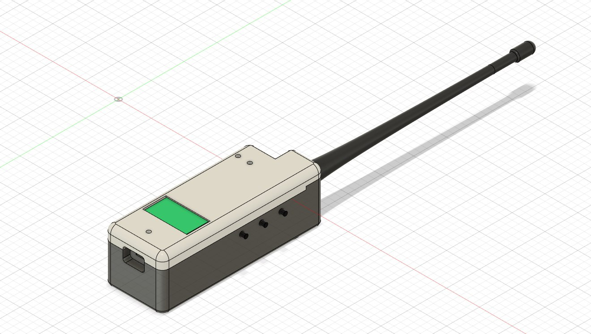

# **SPOKE** - _Stay close!_

  

  <i>*Like a spoke in a wheel</i>

Spoke is a GPS-based Local Relative Navigation System (LRNS) for group of up to 5 members. It allows you to share your positional data in **real-time** among other Spoke-devices and navigate to each of them in a relative manner by providing **Distance** and **Azimuth** information - like radar does. There are some other helpful features that allows you to stay close, like geo-fence, timeout and user alarm. Also you can navigate to saved points!

## Demonstration

Join our chat to see more: <[https://t.me/lrns_eleph](https://t.me/lrns_eleph)>

  

  

## Problem & Solution

As long as you stay under cell-coverage a navigation, either absolute or relative, is not a problem at all. You just use your smartphone with maps and messengers to find or share location. Things change when you go off-grid. Hiking, skiing, sailing or whatever outdoor activity are a potential place to lose sight of your teammates. How to navigate in the group? Hopefully, there are couple of solutions available on the market:

* [LynQ](https://lynqme.com/pages/dev-consumer)
* [XQUAD](https://www.indiegogo.com/projects/xquad-smart-location-tracking-without-phones#/)
* [GoFindMe](https://www.indiegogo.com/projects/gofindme-a-gps-tracker-works-without-cell-service/#/)
* [GoTenna](https://gotennamesh.com/products/mesh)
* Also [GARMIN Dog collar](https://buy.garmin.com/en-US/US/c12522-p1.html)
* Also any [AIS](https://en.wikipedia.org/wiki/Automatic_identification_system) system

unfortunately all of them are commercial. But not the **Spoke**! 

**Spoke** is _open-source/open-hardware_ device which contains all major features needed for group navigation, such as:

* Detailed, absolute positional information about each device in a group
* Radar-like interface with relative positional information about each device in a group
* eCompass for quick orientation
* Memory points to save a positional data and navigate it later
* GeoFence alert feature
* Timeout alert feature
* Alarm button

Due to open-source and simple & cheap hardware, Spoke is highly flexible solution that could be adapted to any use case you want:

* Hiking
* Climbing
* Sailing
* Hunting with dogs
* Assets tracking
* and more...

## Technology

Spoke is written in pure C and runs on STM32F103C8T6 microcontroller (aka BluePill). It has UBLOX M8 GPS module to receive both positional data and time signal, Semtech SX126x radio transceiver to exchange with radio packets between devices, LSM303DLHC accelerometer/magnetometer for quick orientation, graphical 1.3" SH1106 OLED display to show information on it, tactile buttons to control the device, passive buzzer to notify about events and couple of LEDs.

  

GPS module provides NMEA-0183 stream at 9600 baud. Microcontroller process the stream using DMA and parse it. Fields being extracted are RMC, GGA, GSA, GSV. Those give us information about time, date, latitude, longitude, speed, course, altitude, satellites in view and in use, navigation mode and validness of data.

GPS module also provides time synchronization signal - PPS. It is used as a time reference for transmitting and receiving radio packets inside a current group of devices. Each group operates at the specific frequency channel, the way like regular radios. Each device in a group has unique predefined number from 1 to 5, so there are 5 members in a group maximum. Spoke uses TDMA technique to give channel access for each group member, so the device number corresponds to the time-slot occupied by device. There is a 900 ms timer which starts counting from the rising edge of the PPS pulse. Within this time the NMEA data is collected and parsed, the positional data of the device is prepared. Then, depending on the device number and current second of the time, either RX or TX takes place. Valid active seconds for RX/TX are 0, 2, 4, 6, 8 for devices 1 to 5 respectively. Repeat occurs every 10, 30 or 60 seconds depending on settings.

  

Spoke uses LoRa modulation and operates in LPD 433 MHz band (please make sure you are allowed to use these frequencies in your region, otherwise you need to change operational frequency in the source code). 

| Channel | Frequency    |
|---------|--------------|
| CH1     | 433.175 MHz  |
| CH2     | 433.375 MHz  |
| CH3     | 433.575 MHz  |
| CH4     | 433.775 MHz  |
| CH5     | 433.975 MHz  |
| CH6     | 434.175 MHz  |
| CH7     | 434.375 MHz  |
| CH8     | 434.575 MHz  |

LoRa parameters are SF12, BW125, CR 4/8, Header off, CRC on. Packet structure is shown below. It consist of 12 bytes payload and in total takes ~1.25 s to be transmitted over-the-air.

| 10 symb  |    12 bytes     | 2 bytes |
|----------|-----------------|---------|
| Preamble | Payload (below) | CRC     |

|       1 byte       | 1 byte | 4 bytes  |  4 bytes  | 2 bytes  |
|--------------------|--------|----------|-----------|----------|
| Device ID & Number | Flags  | Latitude | Longitude | Altitude |

Additionally, complete navigational data of all active devices is outputted via physical UART console pins in readable HEX format at 115200 baud.

## Calculation

In order to calculate relative positions of other devices, Spoke uses two formulas. First one is [Haversine formula](https://en.wikipedia.org/wiki/Haversine_formula) which determines the distance between two points on a sphere. The second one is [Loxodrome formula](https://en.wikipedia.org/wiki/Rhumb_line) which determines bearing to a point on a sphere relative to true north. All calculations are performed with a highest possible, double precision, so the results are in a great agreement with my simulations on PC. Precision of the formulas is another matter. It is known that haversine formula is numerically better-conditioned for small distances, but on the other side it doesn't take into account ellipsoidness of the Earth and uses it's mean radius. Also it is known that loxodrome (or rhumb line) shows not-the-shortest way to reach point of interest (the shortest way is provided by orthodrome, or great circle route), but the constant bearing, which is more useful in practice. Anyway, my simulations using Google Earth Pro ruler leave me no concerns about accuracy of used formulas. According to them the error for both is less than 1% as long as the distance is smaller than 300 km (!).

  <i>(courtesy of <a href="https://www.esri.com/arcgis-blog/products/product/mapping/mercators-500th-birthday/">ESRI</a>)</i>

---
